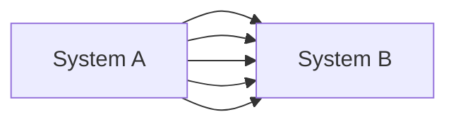
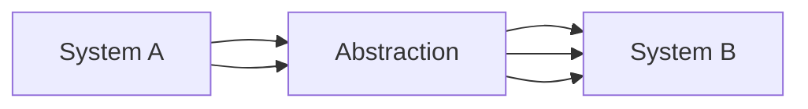

# On Coupling and Abstractions

This chapter is a digression from the building of our furniture retailer system to review abstractions.

## Why Use Abstractions?
We use abstractions to hide messy details.  When working on small personal projects it is easy to try out different approaches, aggressively refactor, and hammer out details, in large scale systems our ability to make changes becomes constrained by decisions made in other areas.

When we cannot make changes in component A because it may cause breaking in component B we say those components are _coupled_.  Locally coupled components are often a sign that parts of the software are working well together.

However, **global coupling** becomes a serious headache very quickly as risk and cost of code changes increases eventually to a point where it is impossible to change anything about our software.  This is the Big Ball of Mud problem.  We can reduce this through the use of abstractions.

Going from

to

By using an abstraction in the middle to simplify the interfaces,
we reduce the individual linkages between subsystems A & B, thus making it easier to change one or the other without breaking the entire system.

## How to Get Started

Often it can be overwhelming, when you start to write some code, to try to consider where and how you will need to apply abstractions.  This can lead to decision paralysis and panic.  In these times I often think of the following:

> Pre-optimization is the devil
    - Annonymous software engineer

Start by writing the most simple, naive solution to the smallest part of the problem and interatively improve the solution to better handle use & edge cases.

## Choosing Abstraction(s)

Consider the responsibilities your code has.  Try to separate these core responsiblities into distinct operations.  Once you've identified those responsibilities, refactor your code to separate out the details of each operation and ingest/return only what is needed by the other components.  

Try to separate **what** your software does from *how* it does it.  Also strive to keep the inputs and outputs as simple as possible.
