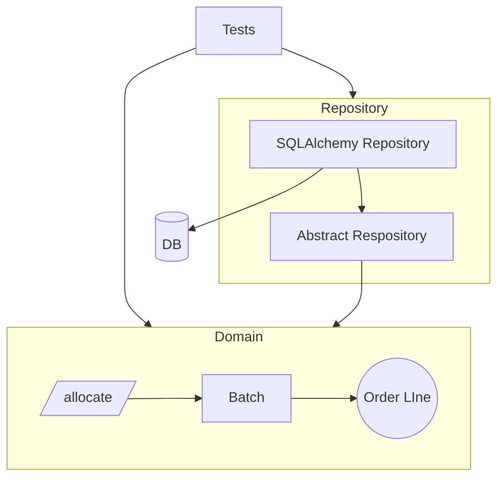
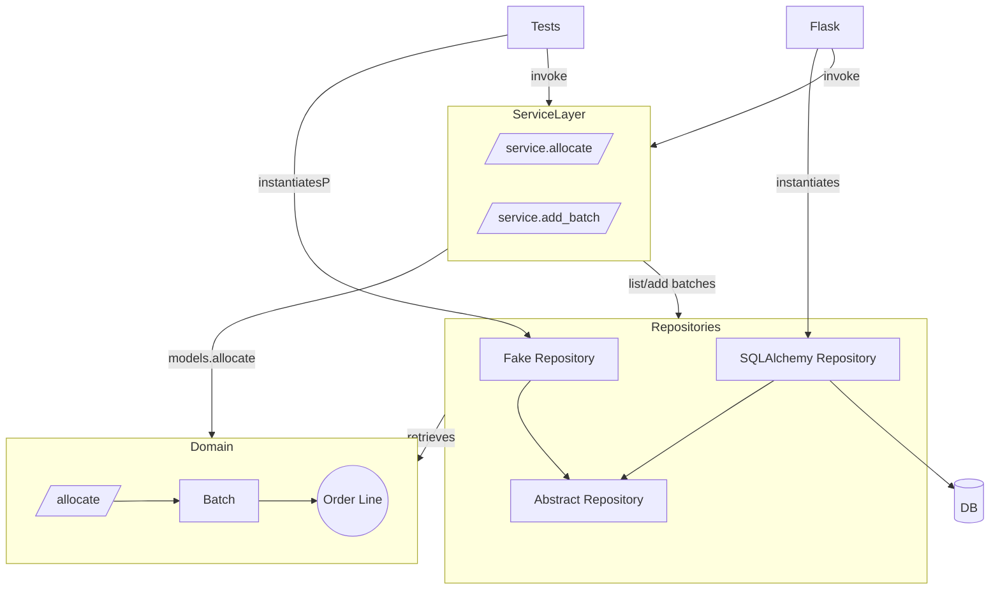

This chapter will introduce the `Service Layer` and further abstract the interface with our domain & repository patterns.  We wll also start to wire up our Flask API.

## Starting Architecture:

---
## Eventual Architecture
We are going to build out our system to match the following architecture:

We will also be exploring the differences between ochestration logic, business logic and interface code.  The `Service Layer` we introduce in the above architecture will handle the orchestration of workflows.  It also serves to define the use case(s) for our system.

Impmlementing a service layer with our repository pattern also allows us to write tests faster and more complete.