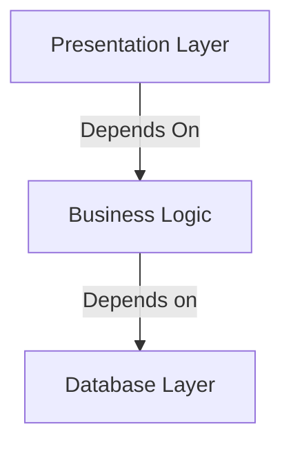

These are the primary principles of software engineering that will be utilized throughout this book.

## Encapsulation/Abstraction
One of the most common paradigms used by programmers to simplify code and improve readability.  This is done through two closely related concepts:
* Simplifying behavior
* Hiding data.

In this book we will be focusing on simplifying behavior by _encapsulating_ implementation details in _abstractions_.

## Layering
Layering is the process of separating software components into layers that represent their area of concern.  A classic example of this for a web application is as follows:

## Dependency Inversion Principle
This practice means inverting the common dependency of high level modules on low level modules.  Using abstractions for the interfaces between each means no part of the software being designed is dependent on a specific implementation of any other.  As long as the abstractions maintain the same interfaces we can change our concrete components at will.

## Domain Model:
This is the middle layer, or business logic layer, of our application.  A common flaw that causes technical debt to accumulate is allowing business logic to spread across all layers, making changes difficult to implement. 

The Domain model approach works to encapsulate all business logic aspects of the problem software is attempting to solve in the business layer.  Presenting the visual layer, triggering actions, persisting data; these are separate from the domain.