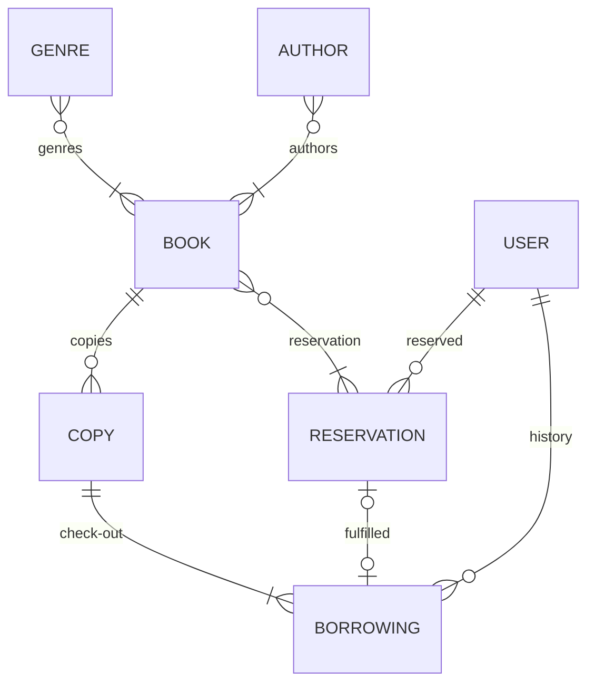

## Data Model Requirements
* **Genre**:  Capture data on literary genres
    * Relates to Book instances
* **Author**: Capture details of the authors in a library collection
    * Relates to Book Instances
* **Book**: Capture a general book and it's attributes (Author, Genre, etc.)
    * Relates to Author, Genre, Copy, and Reservation instances.
* **Copy**: Store data on specific copies of books.  These are the physical representations of the general Book class.
    * Relates to Book instances
* **Reservation**: Catpure details of a reservation by a patron for a book
    * Relates to Book, BorrowedCopy, and User instances

* **Borrowing History**: Captures details of patrons checking out books.  Late fees are captured in these records
    * Relates to Copy, User instances

* **Users**: Library patrons and librarians
    * Relates to Reservation, and Borrowing History

## ERD for Data Models

