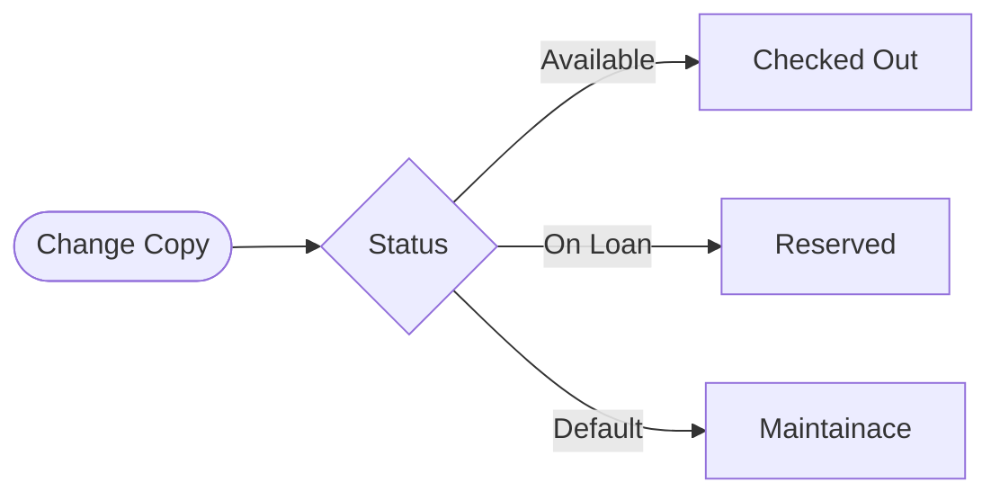
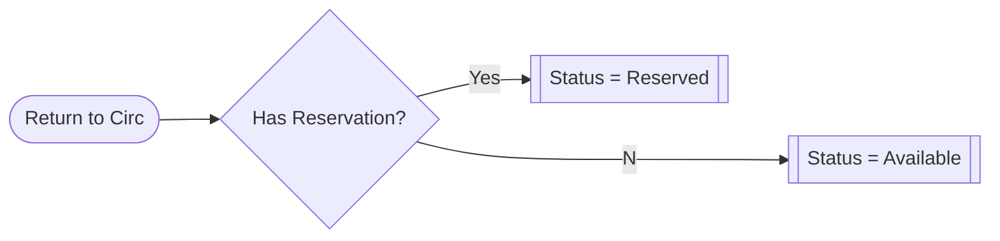

## Workflow

In determining how I want to solve this problem I should first break down the workflow I envision for our `Book`,  `BookInstance`, `BorrowedCopy`, and `Reservation` records.

- `BorrowedCopy` records represoent the borrowing history of each copy but in certain situations repsent the current state of a copy.
  - When `date_checked_out` has a value but `date_returned` does not, this indicates the copy is `ON_LOAN`.
- Library Patrons can create `BorrowedCopy` record for a given `BookInstance` that is in the `AVAILABLE`.
- Where a particular `Book` has no `BookInstance` records with a status of `AVAILABLE`, Patrons create a `Reservation` record.
- Only Library Staff can change a `BookInstance` status from `ON_LOAN` to any other status. In effect, they are responsible for returning a book to circulation.
- The presence or absence of a `Reservation` record without a related `BorrowedCopy` record for a given `Book` determines if it returns to an `AVAILABLE` or `RESERVED` status upon being returned to circulation.  
  - Since the `Reservation` model also captures when patrons cancel their reservation prior to checking out a copy of the reserved book we will need to included `canceled=False` in our filter criteria.

## Controlling `BookInstance` Status

Writing out the workflow is a great exercise and typing the list above helped clarify a few things for me. Initially I was thinking I could create an annotation that evaluates any related `BorrowedCopy` records for a given `BookInstance` and return this as the default for the status. While this approach does have the benefit of always being the most up to date (since it is caclulated each time a record is acccessed) it also increases the complexity of the SQL generated to fetch our record. In this scenario the `status` field would cease to exist on the `BookInstance` model per se and only be returned as a dynamically caculated value.

However, this approach cannot statisfy one of the requirements of the above workflow. That is that only Library staff can return a copy to circulation. This rules out the pure annotation approach since some changes in status are not controlled by related record values.

### Static Fields Approach

While we must rely on a static model field to get the functionality we want, we can still utilize a similar approach that moves more of the operations to the database layer. This will help make sure that the application can better scale as the library gets more popular or patrons getting into reservation wars for the most popular books.

I'll use Django's nifty [Conditional Update](https://docs.djangoproject.com/en/3.1/ref/models/conditional-expressions/#conditional-update) approach. This allows me to specificy various criteria in `When` clauses that will be evaluated in the database and which value should be written to the status field depending on which clause returns `True`.

Now where to put this little bit of logic? Well the returning to circulation operaton happens directly with the BookInstance model so it would seem that we need a model method to represent that action wherein we will place this logic. _However_ we also need to revise the logic in the `save()` method for the `BorrowedCopy` model to accurately reflect the intended workflow.

In order to avoid having to maintain multiple copies of the same logic I will use one of my favorite features of Django annotations. That is they can be defined and assigned to a variable, outside of calling the actual query. This means I can _hopefully_ create a single definition of this business logic and reuse it in multiple model methods.

### On Second Thought...

We'll need two versions of the conditional update annotation.

- `status_patrons`: The one for library patrons will determine if it should set the copy's status to `ON_LOAN` (checking out) or `MAINTENANCE` (returned and awaiting library staff).
- `status_staff`: The one for staff will determine if a copy should be set to `RESERVED` (if `Reservation` records without a related `BorrowedCopy` record) or `AVAILABLE` (if not) when it is returned to circulation (or taken out of `MAINTENANCE` status).

The benefit of this approach is we don't need to require either staff or patrons to know what the appropriate status is to set for the copy. Of course the front-end will determine whether to present a 'Check Out' or 'Reserve' button to the user (or both) for the patrons. For the staff, I will do a little bit of [customizing the default Django admin interface](https://docs.djangoproject.com/en/3.1/ref/contrib/admin/actions/) to allow staff to 'Return to Circulation' for multiple copies at once.

In this case I get to play with a few of the nifty advanced ORM features of Django. Let's take a look!

### Annotations for Static Field Values

- First I'm using the [`OuterRef` to nest subqueries](https://docs.djangoproject.com/en/3.1/ref/models/expressions/#subquery-expressions) within the overall `Case` statement. I will use these subqueries to define each of statuses.

```python
"""
  catalog/annotations.py
"""

from django.db.models import OuterRef
from catalog.models import BorrowedCopy, Reservation
# When using the OuterRef function, this annotation must be called as
# part of a query on the related object, BookInstance in this case.

# Define condition in which a copy is checked out.
checked_out = BorrowedCopy.objects.filter(
  copy=OuterRef('pk'),
  date_checked_out__isnull=False,
  date_returned__isnull=True
)
# Define condition in which a copy is reserved
# In this case the Book FK is referenced 
reserved = Reservation.objects.filter(
  book=OuterRef('book_id'),
  borrowed_copy_id__isnull=True,
  canceled=False
)
```

- Next we roll up each of these subqueries inside a Case statement. To make this simple as well as provide some potential query optimization, I will be applying the [`Exists` subquery class](https://docs.djangoproject.com/en/3.1/ref/models/expressions/#exists-subqueries) along with the rest of the `Case..When` functionality that are part of Django ORM's [conditional expressions](https://docs.djangoproject.com/en/3.1/ref/models/conditional-expressions/#) toolbox.

```python
"""
  catalog/annotations.py
"""
...
from django.db.models import Value, CharField, Case, When
from catalog.models import BookInstance

status_patrons = Case(
  When(Exists(checked_out), then=Value(BookInstance.ON_LOAN)),
  When(Exists(reserved), then=Value(BookInstance.RESERVED)),
  default=Value(BookInstance.MAINTENANCE),
  output_field=CharField()
)

status_staff = Case(
  When(Exists(reserved), then=Value(BookInstance.RESERVED)),
  default=Value(BookInstance.AVAILABLE),
  output_field=CharField()
)
```

The `When` clause expects a dynamic value as the `then` keyword argument so to get this working as expected we wrap our static status values in the `Value` class. This ensures we write back "o" for `ON_LOAN` rather than go looking for a field called "o".

The `Case` statement will evaluate each `When` clause in order so even if a book being checked out has other future reservations, the `status_patrons` clause will still return the character value designating the status as "on loan". This is another example of why I like to declare each statically define choice to it's own static variable on the model (take a look at the BookInstance definition [[here|projects.localibrary.models.copy_borrowed]] if you need a refresher). It means there is a single source of truth when it comes to static values in the application.

### Implementing Annotation + Static Field Approach

Alright, I think I've got my subqueries and annotations worked out. Now to plug them into the application workflow. For the patrons this is pretty simple. We just replace the setting of the status field from a manual value to using the query result defined above:

```python
def save(self, *args, **kwargs):
        """Override default save method to set due date and update copy status"""
        logger.info(f'Calling model save method for {self}')
        from .annotations import status_patrons
        BookInstance.objects.filter(pk=self.copy.id).update(
            status=status_patrons
        )
        # We are going to use these records to hold reservations as well
        # so we need to accomodate situations where date_checked_out = None
        if self.date_checked_out and not self.due_date:
            self.due_date = self.date_checked_out + self.CHECKOUT_DURATION
        if self.date_returned and self.date_returned > self.due_date:
            # Assigning late fee if returned after due date
            self.assessed_late_fee = (self.date_returned -
                                      self.due_date).days * self.LATE_FEE
        super().save(*args, **kwargs)

```

You can compare this to the previous `save()` method [[here|projects.localibrary.models.copy_borrowed]] to see the difference but here's the plain english version. We import the query (doing it within the method to avoid circular import issues) and update the related copy. We use the `.filter()` approach because the `update()` functionality belongs to the `Queryset` object, not an individual record. Additionally the `status_patrons` includes a `Subquery` clause so it needs to be placed within an outer query in order to operate as expected. Since the decision of what status should be assigned is handled by the query we get to call this without doing any `if...else` checks first. That is still done to set due_dates and late fees. At some point I might look into streamlining that. But for now this does the trick. Since both checking out and returning book actions in the front-end trigger the `save()` method for the `BorrowedCopy` model, this handles both actions nicely.

Here is a basic flowchart of how the book status will change based on the overwritten `save()` method and the queryset annotations



Now let's take a look at the implementation of the staff workflow. This makes use of one of the coolest features of the [Django admin site](https://docs.djangoproject.com/en/3.1/ref/contrib/admin/). That is the amazing amount of customization that is possible. The admin site comes with basic CRUD functionality built in, assuming you have properly registered any custom models in the autogenerated `admin.py` file. Since I've decided that library staff would be using the Django admin site, this means we just need to add one additional option to the `BookInstance` model. And it's **super** easy! Let's take a look:

I like to keep functionality encapsulated so I create a separate file:

```python
"""
    catalog/admin_functions.py

    Creating custom funcionality to be added to the Django admin site.
    https://docs.djangoproject.com/en/3.1/ref/contrib/admin/actions/

    Function(s):
    * return_to_circulation:  Sets `BookInstance` status based on `BorrowedCopy` subquery results
"""

from .annotations import status_staff


def return_to_circulation(modeladmin, request, queryset):
    """
    Assign correct `status` value to `BookInstance` based on `BorrowedCopy` subquery

    Args:
        modeladmin (ModelAdmin): ModelAdmin objeect for `BookInstance`
        request (HttpRequest): HttpRequest object
        queryset (Queryset): Queryset object of `BookInstance` records to be modified.
    """
    queryset.update(status=status_staff)


# Adding a more helpful descrption to be rendered in the admin interface
return_to_circulation.short_description = 'Return copies to circulation'
```

When I said this was super easy, I wasn't kidding. There are lots of comments so it may look like more is going on here but essentially `queryset.update(status=status_staff)` is all we need to do. Everything else is just good housekeeping. Now how do we assign this functionality to our admin site? In the `admin.py` file of course! More specifically, the `InstanceAdmin` class definition.

```python
catalog/admin.py
from .admin_functions import return_to_circulation
...
class InstanceAdmin(admin.ModelAdmin):
    ...
    actions = [return_to_circulation, ]  # yes it's really this simple
    ...
```


After these changes are saved library staff can update returned books to the correct status in bulk. Let's think about how cool that is for a second. A tired librarian could come in on Monday to find hundreds of books returned and awaiting return to circulation. Rather than having to look at each record and see if there are any pending reservations before updating the status of each book copy, the staff member could simple "Select All" and update the status. I think that's pretty damn nifty.


