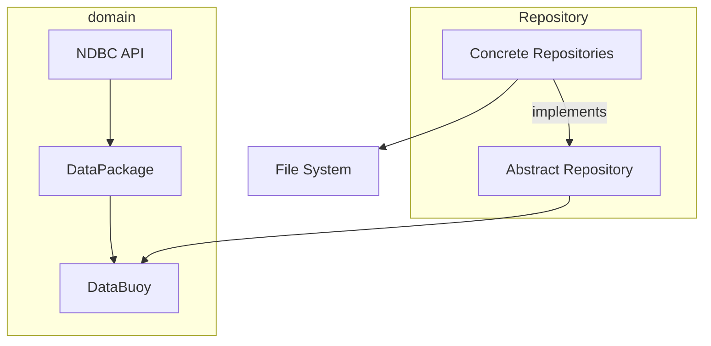
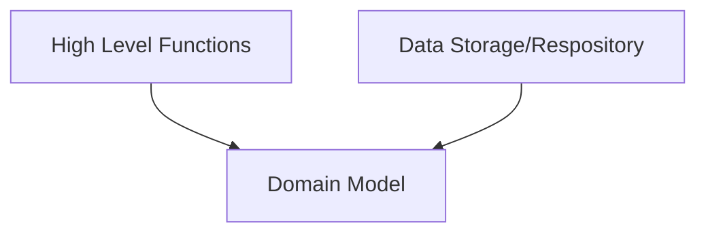

_Applying the Repository pattern for abstracting data storage_

---

![[projects.ndbc-reader.design.repository.persistence]]

Let's start with a simple diagram of what we are trying to achieve here.

This design pattern will abstract away the data layer of our software from the model/business logic.  We are attempting to split this software (originally conceived as a single class with a large number of functions) into a layered, or more accurately onion, architecture design.  Let's make another diagram for this approach so we know where we're going.

The book (architecture patterns in Python) is assuming the use of a database and using and SQLAlchemy ORM to handle interactions.  In our case we are just looking to write to a file but we can apply some of the same principles to help make our [[projects.ndbc-reader.design.domain]] unaware of how the data is loaded/saved.

 ## Dependency Inversion Principle
 One of the major goals of the design patterns outlined in _Architecture Patterns in Python_ is that our high-level business logic should have no direct dependencies.  Rather than our higher level software being dependant on lower level code, we seek to invert this relationship, with our lower-level, less abstract/more concrete, code being dependant on our high-level, more abstract business logic.

 The purpose for this is that it allows for modification to the concrete implementation of various functionalities without modifying the code in our business logic.  A good way to identify this in practice when reviewing the actual code written is which files depend or "know about" which others.  If we do it right in the context of this project the `NDBC.DataBuoy` class should know nothing about 
 1. How we make HTTP requests to NDBC web servers
 1. How we save `DataBuoy` data to disk
 1. How we retrieve data from disk.

 ### Implementation

 In the book, the authors are making use of SQLAlchemy ORM tools to create an ORM that depends on our domain models.  In the case of NDBC, the ORM should be responsible for mapping the `DataBuoy` contents to a specific JSON document structure.

I'm not entirely sure how best to accomplish this but I'm going to start simple and refactor often.  I will start by creating a, potentially superfluous, ORM to abstract read/write operations.  

**Observation:** As I work through this process I see plenty of places where I have hard-coded values.  This makes me cringe but at the same time I know I can go _way_ overboard in refactoring.  Like with SQL databases, any value that is used multiple times is often defined in a single place and referenced.  However, it is possible to go too far in this respect.  While I have seen some Python code abstract all constants to a separate file/package, I think this moves constant definitions too far from where they are used making it difficult to understand their importance.  I try to remember these two important lines from the `Zen of Python`

> special cases aren't special enough to break the rules

> but practicality beats purity

To that end I have created a `BuoyORM` class that currently handles reading from and writing to `.json` files.  I've abstracted out _most_ of the hardcoded key values to facilitate using them in both read & write operations.